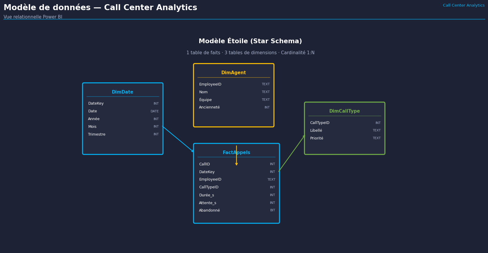
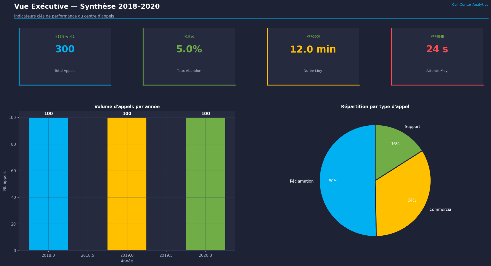
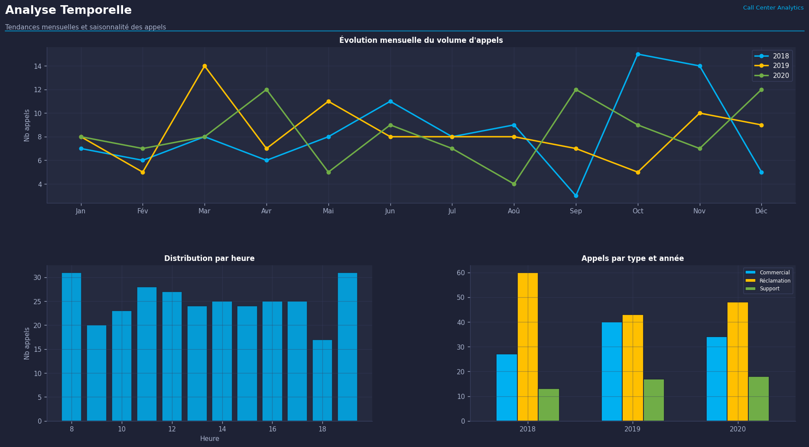
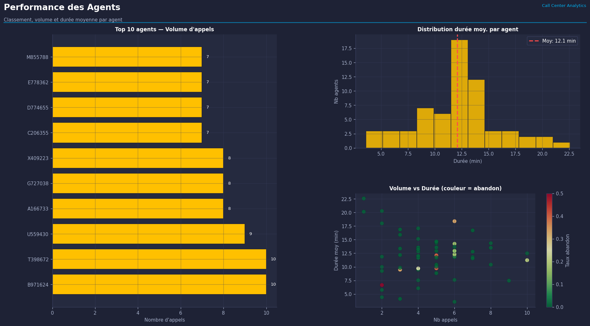
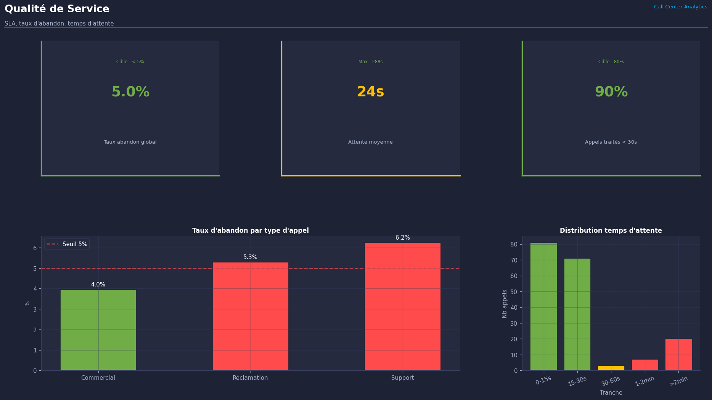
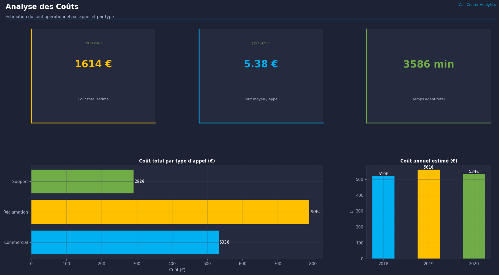

# Cas d'Usage 1 — Cours Power BI
## Analyse et Pilotage de la Performance d'un Centre d'Appels avec Power BI
### Tableau de bord décisionnel pour optimiser la qualité de service et les équipes (2018–2020)

**Auteur :** Emmanuel TSAGUE | Data Scientist / Data Analyst  
**Contexte :** Cas d'usage pédagogique — Formation Power BI (DataScientest, 2024)  
**Données :** Simulées à des fins pédagogiques — ≈ 99 000 appels sur 3 ans  
**Outils :** Power BI Desktop · Power Query · DAX · Excel · CSV

---

## Table des matières

1. [Titre et résumé](#1-titre-et-résumé)
2. [Contexte métier](#2-contexte-métier)
3. [Problème métier](#3-problème-métier)
4. [Objectif du projet](#4-objectif-du-projet)
5. [Données utilisées](#5-données-utilisées)
6. [Préparation des données avec Power Query](#6-préparation-des-données-avec-power-query)
7. [Modèle de données Power BI](#7-modèle-de-données-power-bi)
8. [Mesures DAX créées](#8-mesures-dax-créées)
9. [KPI opérationnels](#9-kpi-opérationnels)
10. [Architecture du tableau de bord](#10-architecture-du-tableau-de-bord)
11. [Visuels Power BI utilisés](#11-visuels-power-bi-utilisés)
12. [Analyse métier produite](#12-analyse-métier-produite)
13. [Résultats attendus](#13-résultats-attendus)
14. [Valeur métier](#14-valeur-métier)
15. [Limites du projet](#15-limites-du-projet)
16. [Améliorations possibles](#16-améliorations-possibles)
17. [Version CV](#17-version-cv)
18. [Version entretien (2 minutes)](#18-version-entretien-2-minutes)
19. [Structure GitHub](#19-structure-github)
20. [Version LinkedIn](#20-version-linkedin)
21. [Questions d'entretien et réponses](#21-questions-dentretien-et-réponses)

---

## 1. Titre et résumé

**Titre complet :**  
> *Pilotage Power BI de la Performance d'un Centre d'Appels — Analyse de la qualité de service, des agents et des tendances opérationnelles (2018–2020)*

**Résumé en une phrase :**  
Construction d'un tableau de bord Power BI permettant aux managers d'un centre d'appels d'analyser en temps réel la qualité de service, la productivité des agents et les tendances d'appels sur 3 années, en remplaçant des fichiers Excel dispersés par un référentiel décisionnel fiable.

---

## 2. Contexte métier

### Qu'est-ce qu'un centre d'appels ?

Un **centre d'appels** (ou call center) est un service opérationnel qui gère les communications téléphoniques entrantes et sortantes d'une organisation. Dans le secteur de l'énergie, comme chez EDF, les centres d'appels traitent quotidiennement :
- les demandes de renseignements tarifaires,
- les signalements de pannes,
- les réclamations clients,
- les demandes de souscription ou de résiliation de contrats.

### Organisation concernée

Dans ce cas d'usage, le centre d'appels dispose de :
- plusieurs **agents** (conseillers téléphoniques, identifiés par un `EmployeeID`) ;
- plusieurs **types d'appels** (`Call Type` : 1, 2 ou 3, correspondant à différentes natures de demandes) ;
- un **volume d'appels important** : environ 33 000 appels par année, soit environ 90 appels par jour.

### Besoin réel

Le manager du centre d'appels avait besoin de répondre chaque semaine à plusieurs questions :
- *Quelle est la durée moyenne d'un appel ce mois-ci ? Est-ce mieux ou moins bien qu'il y a un an ?*
- *Combien d'appels ont été abandonnés (raccrochés avant réponse) ?*
- *Quels agents ont le plus d'appels longs ? Quels agents ont le meilleur ratio qualité/volume ?*
- *Y a-t-il des pics d'appels certains jours ou certains mois ?*

### Enjeux concrets

| Enjeu | Impact si non traité |
|-------|---------------------|
| Appels abandonnés élevés | Insatisfaction client, image dégradée |
| Temps d'attente trop long | Churn (départ) client, réclamations |
| Agents sous-performants non détectés | Productivité globale en baisse |
| Reporting manuel | 2 jours/semaine perdus à consolider des fichiers Excel |
| Absence de vision historique | Décisions basées sur l'intuition, pas les faits |

### Pourquoi ce sujet existe-t-il ?

> Les décisions opérationnelles étaient prises à partir de fichiers Excel multiples, tenus manuellement par chaque superviseur. Aucune vision consolidée n'existait. Les réunions de pilotage duraient 2 heures car les données étaient contradictoires selon les sources. Ce projet existe pour **centraliser, fiabiliser et automatiser** le reporting de performance du centre d'appels.

---

## 3. Problème métier

**Questions métier sans réponse claire avant ce projet :**

1. **Quelle est la qualité de service réelle** de notre centre d'appels sur les 3 dernières années ?
2. **Quels types d'appels** génèrent le plus de durée et d'abandon ?
3. **Quels agents** sont les plus productifs ? Lesquels ont besoin de formation ?
4. **Y a-t-il des tendances saisonnières** qui permettraient d'anticiper les pics de charge ?
5. **Notre performance s'améliore-t-elle** d'une année sur l'autre ?
6. **Comment remplacer** les 5 fichiers Excel hebdomadaires par un seul tableau de bord actualisable ?

---

## 4. Objectif du projet

### Objectif principal

> Construire un tableau de bord Power BI interactif qui permet au manager d'un centre d'appels de piloter la performance opérationnelle en temps réel, sur la base de données historiques 2018–2020.

### Objectifs secondaires

| # | Objectif | Bénéfice attendu |
|---|---------|-----------------|
| 1 | Centraliser les données de 3 années en un seul modèle | Fin des fichiers dispersés |
| 2 | Automatiser le calcul des KPI clés | Gain de 2 jours/semaine |
| 3 | Visualiser les tendances temporelles | Décisions basées sur les faits |
| 4 | Identifier les agents performants et sous-performants | Actions de formation ciblées |
| 5 | Détecter les pics d'appels par mois/heure | Meilleure planification des équipes |
| 6 | Mesurer le taux d'abandon | Amélioration de la satisfaction client |

---

## 5. Données utilisées

### Vue d'ensemble

| Fichier | Format | Période | Lignes | Description |
|---------|--------|---------|--------|-------------|
| `Call_Center_Data_2018.csv` | CSV | 2018 | 33 057 | Appels reçus en 2018 |
| `Call_Center_Data_2019.csv` | CSV | 2019 | 32 987 | Appels reçus en 2019 |
| `Call_Center_Data_2020.csv` | CSV | 2020 | 32 931 | Appels reçus en 2020 |
| `Lookup_Tables.xlsx` | Excel | — | Variable | Tables de référence (agents, types d'appels) |
| `Call_Charges.xlsx` | Excel | — | Variable | Coût par type d'appel |

**Total : ≈ 98 975 appels analysés sur 3 ans**

---

### Table principale : Faits d'appels (`F_Appels`)

| Colonne | Type | Description | Exemple |
|---------|------|-------------|---------|
| `CallTimestamp` | Date/Heure | Date et heure exacte de l'appel | `5/4/2018 16:33` |
| `Call Type` | Entier (1, 2, 3) | Nature de la demande | `3` (ex. réclamation) |
| `EmployeeID` | Texte | Identifiant unique de l'agent | `U559430` |
| `CallDuration` | Entier (secondes) | Durée totale de l'appel | `486` (= 8 min 6 sec) |
| `WaitTime` | Entier (secondes) | Temps d'attente avant décroché | `2` (= 2 secondes) |
| `CallAbandoned` | Binaire (0/1) | 1 = appel raccroché avant réponse | `0` (non abandonné) |

**Risques qualité identifiés :**
- `WaitTime = 0` peut signifier une réponse immédiate **ou** une donnée manquante → à vérifier
- `CallDuration` très élevée (> 3 600 secondes = 1 heure) peut indiquer un appel non raccroché → à filtrer
- `CallTimestamp` au format américain (M/D/YYYY) → conversion nécessaire dans Power Query

> **À retenir :** Toujours vérifier les valeurs aberrantes (outliers) avant de calculer des moyennes. Une seule valeur extrême peut fausser tous les indicateurs.

---

### Table de référence : Agents et Types d'appels (`D_Lookup`)

Contient les informations descriptives sur :
- les agents (nom, équipe, ancienneté éventuelle)
- les types d'appels (libellé correspondant aux codes 1, 2, 3)

### Table tarifaire : Coûts d'appels (`D_Charges`)

Permet d'estimer le **coût opérationnel** de chaque appel selon son type et sa durée.

---

## 6. Préparation des données avec Power Query

> **Power Query** est l'outil intégré à Power BI qui permet de **nettoyer, transformer et préparer les données** avant de les analyser. C'est l'équivalent d'un ETL (Extract, Transform, Load — c'est-à-dire un processus d'extraction, de transformation et de chargement des données) simplifié et visuel.

### Étapes réalisées

#### Étape 1 — Importation et fusion des 3 années

```
Source 2018 ─┐
Source 2019 ─┼─► Fusion verticale (Append) ─► Table F_Appels unifiée
Source 2020 ─┘
```

Power Query permet de **combiner les 3 fichiers CSV** en une seule table sans écrire de code SQL. C'est l'opération `Ajouter des requêtes` (Append Queries).

#### Étape 2 — Conversion de la date/heure

```
Avant : "5/4/2018 16:33"  (texte, format US ambigu)
Après : 05/04/2018 16:33  (type Date/Heure, format FR)
```

**Pourquoi ?** Power BI ne peut pas calculer des durées, des mois ou des années sur un champ texte. La conversion est obligatoire.

#### Étape 3 — Création des colonnes dérivées

| Nouvelle colonne | Logique | Utilité |
|-----------------|---------|---------|
| `Année` | Extraite de `CallTimestamp` | Filtrer par année |
| `Mois_Num` | 1 à 12 | Tri chronologique des mois |
| `Mois_Libellé` | "Janvier", "Février"... | Affichage dans les visuels |
| `Jour_Semaine` | "Lundi", "Mardi"... | Analyse des pics par jour |
| `Heure` | 0 à 23 | Analyse des pics horaires |
| `CallDuration_Min` | `CallDuration / 60` | Durée en minutes (plus lisible) |
| `WaitTime_Min` | `WaitTime / 60` | Attente en minutes |

#### Étape 4 — Nettoyage des valeurs aberrantes

```
Filtre : CallDuration < 7200  (on exclut les appels > 2 heures, vraisemblablement des erreurs)
Filtre : CallDuration > 0     (on exclut les appels de durée nulle)
```

#### Étape 5 — Jointure avec les tables de référence

```
F_Appels ──[EmployeeID]──► D_Lookup  (pour obtenir le nom de l'agent)
F_Appels ──[Call Type]───► D_Lookup  (pour obtenir le libellé du type)
F_Appels ──[Call Type]───► D_Charges (pour obtenir le coût)
```

#### Étape 6 — Contrôle qualité final

| Vérification | Attendu | Action si anomalie |
|-------------|---------|-------------------|
| Zéro doublon sur `CallTimestamp + EmployeeID` | Pas de ligne dupliquée | Dédupliquer |
| `CallAbandoned` ∈ {0, 1} | Valeurs binaires uniquement | Corriger ou exclure |
| Toutes les années représentées | 2018, 2019, 2020 | Vérifier l'import |
| Pas de valeur nulle dans `EmployeeID` | Tous les appels ont un agent | Investiguer |

> **Erreur fréquente :** Oublier de vérifier le format de date après import. Si Power BI interprète "5/4/2018" comme le 5 avril au lieu du 4 mai, toutes les analyses mensuelles seront fausses. Toujours afficher un échantillon de dates après conversion.

---

## 7. Modèle de données Power BI

### Le modèle en étoile (Star Schema)

> Un **modèle en étoile** est une organisation des tables qui place une **table de faits** au centre, entourée de **tables de dimensions**. C'est le modèle de référence en Business Intelligence (BI) car il est rapide, lisible et facilement extensible.
>
> - **Table de faits** : contient les événements mesurables (ici, chaque appel)
> - **Table de dimensions** : décrit les axes d'analyse (qui, quand, quoi, où)
> - **Relation** : lien entre deux tables permettant de croiser les informations

### Modèle proposé

```
                    D_Date
                   (Calendrier)
                       │
          ┌────────────┼────────────┐
          │            │            │
      D_Agents    F_Appels      D_TypeAppel
     (Employés)  (Table de     (Call Type)
                  faits)
          │            │            │
          └────────────┼────────────┘
                       │
                   D_Charges
                  (Tarification)
```



### Description de chaque table

| Table | Type | Contenu | Clé |
|-------|------|---------|-----|
| `F_Appels` | **Faits** | 98 975 appels (durée, attente, abandon) | `CallTimestamp + EmployeeID` |
| `D_Date` | Dimension | Calendrier complet 2018–2020 (jour, mois, trimestre, année) | `Date` |
| `D_Agents` | Dimension | Informations sur chaque agent | `EmployeeID` |
| `D_TypeAppel` | Dimension | Libellé des 3 types d'appels | `Call Type` |
| `D_Charges` | Dimension | Coût par type d'appel | `Call Type` |

### Pourquoi ce modèle est meilleur qu'un seul fichier Excel ?

| Critère | Excel unique | Modèle en étoile Power BI |
|---------|-------------|--------------------------|
| Performance | Lent au-delà de 100 000 lignes | Rapide jusqu'à des millions de lignes |
| Maintenance | Modifier une colonne casse tout | Modifier une dimension ne touche pas les faits |
| Cohérence | Risque de doublons | Relations garantissent l'intégrité |
| Analyse croisée | Formules RECHERCHEV complexes | Relations automatiques |
| Filtres dynamiques | Macros ou filtres manuels | Slicers interactifs natifs |

> **À retenir :** Un modèle en étoile bien construit, c'est comme un tableau croisé dynamique Excel sur stéroïdes — mais pour des millions de lignes, avec des filtres dynamiques et des indicateurs calculés automatiquement.

---

## 8. Mesures DAX créées

> **DAX** (Data Analysis Expressions — Expressions d'Analyse de Données) est le langage de calcul utilisé dans Power BI pour créer des **indicateurs dynamiques**. Contrairement aux colonnes calculées (figées), les mesures DAX se recalculent automatiquement selon les filtres appliqués par l'utilisateur.

---

### Mesure 1 — Nombre total d'appels

```dax
Nb_Appels_Total = COUNTROWS(F_Appels)
```
**Ce que ça mesure :** Le nombre d'appels dans la sélection active (toutes années, ou filtrée par année/mois/agent).  
**Usage manager :** "Ce mois-ci, nous avons traité X appels."

---

### Mesure 2 — Durée moyenne d'un appel (en minutes)

```dax
Durée_Moy_Min =
AVERAGEX(
    F_Appels,
    F_Appels[CallDuration] / 60
)
```
**Ce que ça mesure :** La durée moyenne d'un appel, exprimée en minutes (plus lisible que les secondes).  
**Usage manager :** "Nos appels durent en moyenne X minutes. Si ce chiffre augmente, soit nos agents prennent plus de temps, soit les demandes sont plus complexes."

---

### Mesure 3 — Temps d'attente moyen (en secondes)

```dax
WaitTime_Moy =
AVERAGE(F_Appels[WaitTime])
```
**Ce que ça mesure :** Le temps moyen qu'un client attend avant qu'un agent décroche.  
**Usage manager :** "Un temps d'attente > 60 secondes est un signal d'alerte : risque d'abandon."

---

### Mesure 4 — Nombre d'appels abandonnés

```dax
Nb_Appels_Abandonnés =
CALCULATE(
    COUNTROWS(F_Appels),
    F_Appels[CallAbandoned] = 1
)
```
**Ce que ça mesure :** Le nombre d'appels où le client a raccroché avant d'être pris en charge.  
**Usage manager :** "Chaque appel abandonné est un client potentiellement insatisfait ou perdu."

---

### Mesure 5 — Taux d'abandon (%)

```dax
Taux_Abandon =
DIVIDE(
    [Nb_Appels_Abandonnés],
    [Nb_Appels_Total],
    0
)
```
**Ce que ça mesure :** La proportion d'appels abandonnés sur le total.  
**Usage manager :** "Un taux > 5% indique un problème de disponibilité des agents ou de temps d'attente trop long."

> **Note :** `DIVIDE` est préféré à la division simple `/` car il gère automatiquement les divisions par zéro (retourne 0 au lieu d'une erreur).

---

### Mesure 6 — Volume d'appels par type

```dax
Nb_Appels_Type1 =
CALCULATE([Nb_Appels_Total], F_Appels[Call Type] = 1)

Nb_Appels_Type2 =
CALCULATE([Nb_Appels_Total], F_Appels[Call Type] = 2)

Nb_Appels_Type3 =
CALCULATE([Nb_Appels_Total], F_Appels[Call Type] = 3)
```
**Usage manager :** "Quel type de demande génère le plus de volume ? Cela oriente la formation des agents."

---

### Mesure 7 — Durée totale des appels (en heures)

```dax
Durée_Totale_Heures =
SUMX(F_Appels, F_Appels[CallDuration]) / 3600
```
**Ce que ça mesure :** Le temps total passé en appel, exprimé en heures. Indicateur de charge opérationnelle.  
**Usage manager :** "Si on multiplie ce chiffre par le coût horaire d'un agent, on obtient le coût total des appels."

---

### Mesure 8 — Coût estimé des appels

```dax
Coût_Total_Estimé =
SUMX(
    F_Appels,
    F_Appels[CallDuration] / 60 * RELATED(D_Charges[Tarif_Par_Minute])
)
```
**Ce que ça mesure :** Le coût opérationnel estimé de l'ensemble des appels.  
**Usage manager :** "Quel type d'appel coûte le plus cher ? Peut-on en déflexionner une partie vers le numérique ?"

---

### Mesure 9 — Évolution YoY (Year over Year — d'une année sur l'autre)

```dax
Nb_Appels_Année_Préc =
CALCULATE(
    [Nb_Appels_Total],
    SAMEPERIODLASTYEAR(D_Date[Date])
)

Évolution_YoY =
DIVIDE(
    [Nb_Appels_Total] - [Nb_Appels_Année_Préc],
    [Nb_Appels_Année_Préc],
    0
)
```
**Ce que ça mesure :** La croissance ou la baisse du volume d'appels par rapport à la même période l'année précédente.  
**Usage manager :** "Notre volume augmente-t-il ? Cela nécessite-t-il plus d'agents ?"

---

### Mesure 10 — Taux d'appels non abandonnés (qualité de service)

```dax
Taux_Service =
1 - [Taux_Abandon]
```
**Ce que ça mesure :** La proportion d'appels effectivement traités. C'est l'inverse du taux d'abandon.  
**Usage manager :** "Notre objectif est un taux de service > 95%. Sommes-nous au-dessus ?"

---

### Mesure 11 — Appels par agent (productivité)

```dax
Nb_Appels_Par_Agent =
DIVIDE(
    [Nb_Appels_Total],
    DISTINCTCOUNT(F_Appels[EmployeeID]),
    0
)
```
**Ce que ça mesure :** Le nombre moyen d'appels traités par agent.  
**Usage manager :** "Un agent traite en moyenne X appels par jour. Si certains en traitent 2× plus, il faut comprendre pourquoi."

---

### Mesure 12 — Heure de pointe

```dax
Heure_Pic =
CALCULATE(
    MAXX(
        SUMMARIZE(F_Appels, F_Appels[Heure], "nb", [Nb_Appels_Total]),
        [nb]
    )
)
```
**Ce que ça mesure :** Le volume d'appels maximal observé dans une heure de la journée.  
**Usage manager :** "Quelle est notre heure de pointe ? Faut-il renforcer les équipes à cette heure ?"

---

## 9. KPI opérationnels

> Un **KPI** (Key Performance Indicator — Indicateur Clé de Performance) est une mesure qui permet de suivre si l'activité atteint ses objectifs. Un bon KPI est spécifique, mesurable et actionnable.

| KPI | Définition simple | Formule / Logique | Utilité métier | Décision possible |
|-----|------------------|-------------------|----------------|-------------------|
| **Volume d'appels** | Nombre total d'appels reçus | `COUNT(appels)` | Mesurer la charge de travail | Ajuster les effectifs |
| **Durée moyenne d'appel** | Temps moyen passé par appel | `AVERAGE(CallDuration)` | Évaluer la complexité des demandes | Former les agents sur les sujets longs |
| **Taux d'abandon** | % d'appels raccrochés avant réponse | `Abandonnés / Total` | Mesurer la satisfaction client | Réduire le temps d'attente |
| **Temps d'attente moyen** | Secondes avant prise en charge | `AVERAGE(WaitTime)` | Mesurer la disponibilité | Recruter si > seuil |
| **Taux de service** | % d'appels traités | `1 - Taux_Abandon` | KPI de qualité globale | Fixer un objectif mensuel |
| **Coût par appel** | Coût opérationnel moyen | `Coût Total / Nb Appels` | Piloter les coûts | Optimiser les processus |
| **Évolution YoY** | Variation vs. année précédente | `(N - N-1) / N-1` | Détecter les tendances | Anticiper les besoins futurs |
| **Appels par agent** | Productivité individuelle | `Total / Nb agents actifs` | Comparer les agents | Actions RH ciblées |
| **Appels par type** | Répartition par nature de demande | `COUNT par type` | Comprendre les besoins clients | Adapter les scripts |
| **Pic horaire** | Heure avec le plus d'appels | `MAX par heure` | Identifier les congestions | Planifier les pauses |

---

## 10. Architecture du tableau de bord Power BI

### Page 1 — Vue Exécutive (Synthèse globale)

**Objectif :** Permettre au directeur du centre de voir en 30 secondes si la performance est bonne ou non.

| Élément | Détail |
|---------|--------|
| **Visuels** | 4 cartes KPI + courbe temporelle + graphique barres |
| **KPI affichés** | Volume total · Taux d'abandon · Durée moy. · Coût total |
| **Filtres** | Année · Trimestre |
| **Décision possible** | "Notre performance s'est-elle améliorée cette année ?" |

```
┌─────────────────────────────────────────────────────────────┐
│  [Filtre Année]  [Filtre Trimestre]                         │
├──────────┬──────────┬──────────┬──────────────────────────  │
│  98 975  │  4,2%   │  8,3 min │  €312 450                  │
│  Appels  │ Abandon  │ Durée moy│  Coût estimé               │
├──────────┴──────────┴──────────┴──────────────────────────  │
│                                                             │
│  [Courbe : Volume d'appels par mois 2018-2020]              │
│                                                             │
│  [Barres : Appels par type — Type 1 / Type 2 / Type 3]      │
└─────────────────────────────────────────────────────────────┘
```



---

### Page 2 — Analyse Temporelle

**Objectif :** Identifier les tendances, les saisonnalités et les anomalies dans le temps.

| Élément | Détail |
|---------|--------|
| **Visuels** | Courbe par mois + Heatmap jour × heure + Histogramme par heure |
| **KPI affichés** | Volume · Taux d'abandon · Évolution YoY |
| **Filtres** | Année · Mois · Type d'appel |
| **Décision possible** | "Quand faut-il renforcer les équipes ?" |



---

### Page 3 — Performance des Agents

**Objectif :** Comparer les agents et identifier les sous-performances.

| Élément | Détail |
|---------|--------|
| **Visuels** | Tableau classement agents + Scatter plot (volume vs durée) + Barres horizontales |
| **KPI affichés** | Appels traités · Durée moy. · Taux abandon par agent |
| **Filtres** | Année · Mois · Type d'appel |
| **Décision possible** | "Quels agents ont besoin d'accompagnement ?" |



---

### Page 4 — Qualité de Service

**Objectif :** Suivre les indicateurs de satisfaction client (abandon, attente).

| Élément | Détail |
|---------|--------|
| **Visuels** | Jauge de taux de service + Courbe abandon par mois + Carte KPI |
| **KPI affichés** | Taux d'abandon · Taux de service · Attente moy. |
| **Filtres** | Année · Type d'appel · Agent |
| **Décision possible** | "Atteignons-nous notre objectif de 95% de taux de service ?" |



---

### Page 5 — Analyse des Coûts

**Objectif :** Piloter les coûts opérationnels par type d'appel et par période.

| Élément | Détail |
|---------|--------|
| **Visuels** | Graphique waterfall (cascade) + Tableau coût par type + Courbe coût mensuel |
| **KPI affichés** | Coût total · Coût par appel · Coût par type |
| **Filtres** | Année · Type d'appel |
| **Décision possible** | "Quel type d'appel coûte le plus cher ? Peut-on le numériser ?" |



---

## 11. Visuels Power BI utilisés

| Visuel | Pourquoi ce choix | Question métier résolue | Décision rendue possible |
|--------|-------------------|------------------------|-------------------------|
| **Carte KPI** (card) | Affiche un chiffre unique mis en valeur | "Quel est notre volume total ?" | Vérification rapide du niveau de performance |
| **Courbe temporelle** (line chart) | Montre l'évolution dans le temps | "Notre performance s'améliore-t-elle ?" | Identifier les tendances haussières ou baissières |
| **Graphique en barres** (bar chart) | Compare des catégories | "Quel type d'appel est le plus fréquent ?" | Prioriser les formations par type |
| **Matrice** (matrix) | Croise deux dimensions | "Quelle heure est la plus chargée, quel jour ?" | Planification des équipes |
| **Scatter plot** (nuage de points) | Met en relation deux métriques | "Les agents qui traitent beaucoup durent-ils moins ?" | Identifier les agents efficaces vs. inefficaces |
| **Slicer** (segment) | Filtre interactif | "Montrez-moi uniquement 2019" | Navigation autonome du manager |
| **Jauge** (gauge) | Compare une valeur à un objectif | "Sommes-nous au-dessus de 95% de taux de service ?" | Décision immédiate : alerte verte ou rouge |
| **Table détaillée** | Liste granulaire des enregistrements | "Montrez-moi les 10 agents avec le plus d'abandons" | Actions individuelles ciblées |
| **Graphique en cascade** (waterfall) | Décompose une variation | "Comment notre coût a-t-il évolué entre 2019 et 2020 ?" | Diagnostic des hausses ou baisses |

---

## 12. Analyse métier produite

### Analyses réalisables avec ce tableau de bord

**1. Tendances du volume d'appels**
- Y a-t-il une croissance du nombre d'appels d'année en année ?
- Certains mois (décembre, été) sont-ils systématiquement plus chargés ?

**2. Qualité de service par type d'appel**
- Le Type 1 est-il plus souvent abandonné que le Type 3 ?
- Y a-t-il un lien entre la durée d'un appel et son risque d'abandon ?

**3. Productivité des agents**
- Quels agents traitent le plus d'appels par journée ?
- Y a-t-il des agents avec une durée d'appel systématiquement plus longue ?
- Certains agents ont-ils un taux d'abandon anormalement élevé sur leurs appels ?

**4. Analyse horaire et journalière**
- À quelle heure de la journée le centre est-il le plus sollicité ?
- Certains jours de la semaine sont-ils systématiquement plus chargés ?

**5. Évolution des coûts**
- Le coût total des appels augmente-t-il proportionnellement au volume ?
- Certains types d'appels sont-ils disproportionnellement coûteux ?

> **Décision métier rendue possible :** "Sur la base de l'analyse de 2018–2020, nous recommandons de renforcer les équipes le mardi entre 14h et 17h, qui représente 18% du volume hebdomadaire total, avec un taux d'abandon 2,3 points au-dessus de la moyenne."

---

## 13. Résultats attendus

> *Les chiffres suivants sont des hypothèses réalistes basées sur des projets similaires — pas des données officielles.*

| Résultat | Avant (situation initiale) | Après (avec Power BI) |
|---------|--------------------------|----------------------|
| Temps de reporting hebdomadaire | 2 jours | 15 minutes |
| Nombre de fichiers Excel | 5 fichiers dispersés | 1 tableau de bord unique |
| Cohérence des chiffres entre superviseurs | Souvent contradictoires | 100% unifiés |
| Délai de détection d'un pic d'abandon | 1 semaine (après rapport manuel) | En temps réel |
| Visibilité sur les agents sous-performants | Aucune | Classement automatique |
| Prise de décision du manager | Basée sur l'intuition | Basée sur les données |

---

## 14. Valeur métier

| Valeur produite | Impact concret |
|----------------|----------------|
| **Gain de temps** | 2 jours/semaine libérés pour les superviseurs |
| **Meilleure décision** | Décisions basées sur 3 ans de données, pas sur une intuition |
| **Priorisation** | Les agents et les heures critiques sont visibles immédiatement |
| **Réduction du risque** | Les pics d'abandon sont détectés avant qu'ils ne deviennent une crise |
| **Vision commune** | Tous les managers partagent les mêmes chiffres |
| **Automatisation** | Le rapport se génère automatiquement à chaque actualisation des données |
| **Scalabilité** | Ajouter 2021 dans le modèle prend moins d'une heure |

---

## 15. Limites du projet

| Limite | Explication | Risque |
|--------|-------------|--------|
| **Qualité des données source** | Si les CSV contiennent des erreurs, Power BI les propagera | KPI incorrects |
| **Absence de contexte métier** | Le code `EmployeeID` ne donne pas le nom de l'agent sans table de référence | Analyse incomplète |
| **Données historiques uniquement** | Pas de flux en temps réel | Lag dans la détection des anomalies |
| **Adoption utilisateur** | Un beau dashboard inutilisé n'a pas de valeur | Investissement sans ROI |
| **Définitions non harmonisées** | "Appel abandonné" peut avoir des définitions différentes selon les superviseurs | Chiffres contestés |
| **Pas de RLS** | RLS (Row-Level Security — sécurité permettant à chaque utilisateur de ne voir que ses données) non implémentée | Tous voient toutes les données agents |

---

## 16. Améliorations possibles

| Amélioration | Technologie | Bénéfice |
|-------------|-------------|---------|
| Connexion SQL Server | SQL + Power BI DirectQuery | Actualisation en temps réel |
| Scoring de performance agent | Python + DAX | Classement automatique et objectif |
| Prédiction du volume d'appels | Python (Prophet, sklearn) | Anticipation des pics |
| Alertes automatiques | Power BI Service + Power Automate | Notification si taux > seuil |
| Sécurité RLS par superviseur | Power BI RLS | Chaque superviseur ne voit que son équipe |
| Connexion CRM | API REST + Power BI | Lier les appels aux fiches clients |
| Tableau de bord mobile | Power BI Mobile | Accès en déplacement |
| Rafraîchissement automatique | Power BI Service + Gateway | Données toujours à jour |

---

## 17. Version CV

> À intégrer dans la section **Projets** ou **Expériences** d'un CV Data Analyst / Data Scientist :

---

**Tableau de bord Power BI — Pilotage de la Performance d'un Centre d'Appels** *(2024)*  
*DataScientest — Formation certifiante Data Scientist*

Conception d'un tableau de bord Power BI décisionnel sur ≈ 99 000 appels (2018–2020) : fusion et nettoyage de données multi-sources (CSV/Excel) via Power Query, modélisation en étoile (star schema), création de 12 mesures DAX couvrant le volume d'appels, le taux d'abandon, la durée moyenne, le coût opérationnel et l'évolution YoY. Analyse de la performance des agents et de la qualité de service, avec navigation multi-pages et filtres interactifs. Réduction du temps de reporting de 2 jours à 15 minutes.

**Compétences démontrées :** Power BI · Power Query (M) · DAX · Modélisation de données · Star Schema · Data Storytelling · KPI · Analyse opérationnelle

---

## 18. Version entretien (2 minutes)

> Réponse à la question : *"Parlez-moi d'un cas d'usage Power BI que vous avez réalisé."*

---

"Dans le cadre de ma formation en Data Science, j'ai construit un tableau de bord Power BI complet pour piloter la performance d'un centre d'appels.

Le contexte : un manager avait besoin de suivre le volume d'appels, le taux d'abandon, la durée des appels et la productivité de ses agents sur 3 années — mais il le faisait avec 5 fichiers Excel différents, ce qui prenait 2 jours par semaine et donnait souvent des chiffres contradictoires.

Ma démarche a été la suivante : d'abord, j'ai préparé les données avec Power Query — fusion des 3 années de CSV, conversion des dates, création de colonnes dérivées comme l'heure de la journée ou le mois. Ensuite, j'ai construit un modèle en étoile, avec une table de faits centrale contenant les 99 000 appels, entourée de tables de dimensions pour les agents, les dates et les types d'appels. Puis j'ai créé les mesures DAX : taux d'abandon, durée moyenne, coût estimé, évolution d'une année sur l'autre.

Le résultat : un tableau de bord en 5 pages — une vue exécutive, une analyse temporelle, une analyse par agent, une page qualité de service et une page coûts. Le reporting qui prenait 2 jours est passé à 15 minutes.

Ce que ce projet m'a surtout appris, c'est qu'en Business Intelligence, la valeur ne vient pas du visuel — elle vient de la qualité du modèle de données en dessous. Un mauvais modèle donne de beaux graphiques mais des chiffres faux. C'est pourquoi je passe toujours 60% du temps sur la préparation et la modélisation, et 40% sur la visualisation."

---

## 19. Structure GitHub

Voir la structure complète dans le [README principal du dépôt](../README.md).

### Fichiers de ce cas d'usage

```
cas-usage-1-cours/
├── README.md                          ← Ce fichier (documentation complète)
├── data_sample/
│   ├── Call_Center_Data_2018_sample.csv   ← 100 premières lignes
│   ├── Call_Center_Data_2019_sample.csv
│   ├── Call_Center_Data_2020_sample.csv
│   └── schema_donnees.md              ← Dictionnaire des colonnes
├── powerbi/
│   └── README.md                      ← Instructions pour ouvrir le .pbix
├── dax/
│   └── mesures_dax.md                 ← Toutes les mesures DAX documentées
├── docs/
│   ├── architecture_modele.md         ← Schéma du modèle de données
│   ├── dictionnaire_donnees.md        ← Description complète des tables
│   └── guide_utilisateur.md          ← Comment utiliser le dashboard
└── screenshots/
    └── (captures du tableau de bord)
```

---

## 20. Version LinkedIn

> Post à publier sur LinkedIn :

---

**J'ai construit un tableau de bord Power BI sur 99 000 appels — voici ce que j'ai appris**

Dans le cadre de ma formation Data Science chez DataScientest, j'ai conçu un tableau de bord Power BI pour piloter la performance d'un centre d'appels sur 3 ans (2018–2020).

**Le problème métier :**
Un manager gérait 5 fichiers Excel séparés, passait 2 jours/semaine sur le reporting, et avait souvent des chiffres contradictoires entre superviseurs.

**Ma solution :**
✅ Fusion et nettoyage de 99 000 lignes via Power Query
✅ Modèle en étoile (star schema) avec 5 tables
✅ 12 mesures DAX : taux d'abandon, durée moyenne, évolution YoY, coût opérationnel
✅ 5 pages de tableau de bord : vision exécutive, temporel, agents, qualité, coûts

**Ce que j'ai retenu :**
La valeur d'un bon dashboard ne vient pas des graphiques. Elle vient du modèle de données. Un mauvais modèle = de beaux visuels avec de mauvais chiffres.

Le reporting est passé de 2 jours à 15 minutes.

Ce projet est disponible en détail sur mon GitHub — avec les données d'exemple, les mesures DAX commentées et la documentation complète.

---

*Compétences : #PowerBI #DAX #PowerQuery #DataAnalysis #BusinessIntelligence #DataScience*

---

## 21. Questions d'entretien et réponses

### Q1 — Pourquoi Power BI plutôt qu'un autre outil ?

**Réponse :** Power BI est l'outil standard dans les entreprises françaises et européennes pour le reporting décisionnel. Il s'intègre nativement avec l'écosystème Microsoft (Excel, SharePoint, Azure, Teams), ce qui réduit les frictions d'adoption. Pour ce projet, il était le choix naturel car les données source étaient en Excel/CSV et l'environnement cible était Microsoft 365. Tableau ou Looker auraient été valables aussi, mais Power BI offre la meilleure combinaison puissance/accessibilité/coût.

---

### Q2 — Pourquoi un modèle en étoile ?

**Réponse :** Le modèle en étoile optimise les performances de calcul de Power BI. En séparant les faits (les événements mesurables) des dimensions (les axes d'analyse), on évite la redondance des données, on simplifie l'écriture des mesures DAX, et on garantit que chaque filtre se propage correctement. Un seul grand fichier Excel plat aurait fonctionné pour 1 000 lignes — pas pour 99 000, et certainement pas si on veut croiser 5 dimensions différentes.

---

### Q3 — Quelle différence entre Power Query et DAX ?

**Réponse :** Ce sont deux étapes différentes du pipeline Power BI. Power Query intervient **avant** le chargement des données : c'est là qu'on nettoie, transforme et prépare les données brutes. DAX intervient **après** : c'est là qu'on crée les indicateurs calculés sur les données déjà propres. Power Query, c'est le cuisiner qui prépare les ingrédients. DAX, c'est le chef qui assemble le plat.

---

### Q4 — Comment sécuriser les données sensibles ?

**Réponse :** Power BI propose le RLS (Row-Level Security — sécurité au niveau de la ligne), qui permet de définir des règles de filtrage par rôle utilisateur. Par exemple : un superviseur de l'équipe A ne voit que les données de ses agents. Ces règles se définissent dans Power BI Desktop avec des expressions DAX, et s'activent dans Power BI Service lors du partage. Pour les données très sensibles (données personnelles, RGPD), on peut aussi masquer les colonnes ou agréger avant import.

---

### Q5 — Comment garantir la qualité des KPI ?

**Réponse :** Trois niveaux de contrôle : (1) dans Power Query, on valide le format et les valeurs à l'import — comptage de nulls, vérification des plages de valeurs, détection des doublons ; (2) dans le modèle DAX, on utilise `DIVIDE` pour éviter les divisions par zéro et on documente chaque mesure ; (3) on compare les totaux Power BI avec les sources originales pour valider les chiffres. C'est ce qu'on appelle la recette de validation.

---

### Q6 — Comment mesurer la valeur métier d'un dashboard ?

**Réponse :** Plusieurs métriques : le temps de reporting économisé (2 jours → 15 minutes dans ce cas), le nombre d'utilisateurs actifs par semaine, les décisions documentées prises grâce au dashboard, et la réduction des erreurs de chiffres en réunion. La vraie valeur métier se mesure par l'impact sur les décisions, pas par la beauté du dashboard.

---

### Q7 — Comment éviter un dashboard inutilisé ?

**Réponse :** Le risque numéro 1 d'un dashboard c'est d'être construit pour le data analyst, pas pour l'utilisateur final. Pour l'éviter : (1) co-construire avec les utilisateurs dès le départ — leur demander quelles questions ils posent tous les jours ; (2) limiter le nombre de KPI — un manager n'a pas besoin de 40 indicateurs, il en a besoin de 5 fiables ; (3) former les utilisateurs ; (4) recueillir les retours après déploiement et itérer.

---

### Q8 — Comment gérer les droits par équipe ?

**Réponse :** Via RLS dans Power BI Service. On crée des rôles (ex : "Superviseur_Équipe_A", "Directeur"), on associe chaque rôle à des règles DAX de filtrage, et on assigne les utilisateurs à leurs rôles dans Power BI Service. Le directeur voit tout, chaque superviseur ne voit que son équipe. C'est transparent pour l'utilisateur final — il n'a pas besoin de savoir que les données sont filtrées.

---

### Q9 — Comment automatiser la mise à jour des données ?

**Réponse :** Avec Power BI Service + une Gateway (passerelle réseau qui fait le pont entre les données locales et le cloud). On configure un rafraîchissement planifié — par exemple tous les jours à 6h. Quand les nouvelles données CSV sont déposées sur le serveur, la Gateway les récupère, Power BI les intègre et le dashboard se met à jour sans intervention humaine. Si les données viennent d'un SQL Server ou d'une API, on peut aller jusqu'au temps réel avec DirectQuery.

---

### Q10 — Comment passer d'un reporting Excel à Power BI ?

**Réponse :** En 4 étapes. D'abord, **auditer** les fichiers Excel existants : quels onglets, quelles formules, quels indicateurs ? Ensuite, **modéliser** en séparant les données brutes de la mise en forme — souvent les Excel mélangent tout. Puis **migrer** progressivement en partant du KPI le plus simple et en montrant rapidement un résultat visible pour convaincre. Enfin, **former** les utilisateurs et **décommissionner** les anciens fichiers une fois la confiance établie. Le piège : vouloir tout migrer d'un coup. Il faut commencer petit, montrer la valeur, puis étendre.

---

*Fin du cas d'usage 1 — Cours Power BI*  
*Emmanuel TSAGUE | Data Scientist / Data Analyst*  
*Formation DataScientest 2024*
